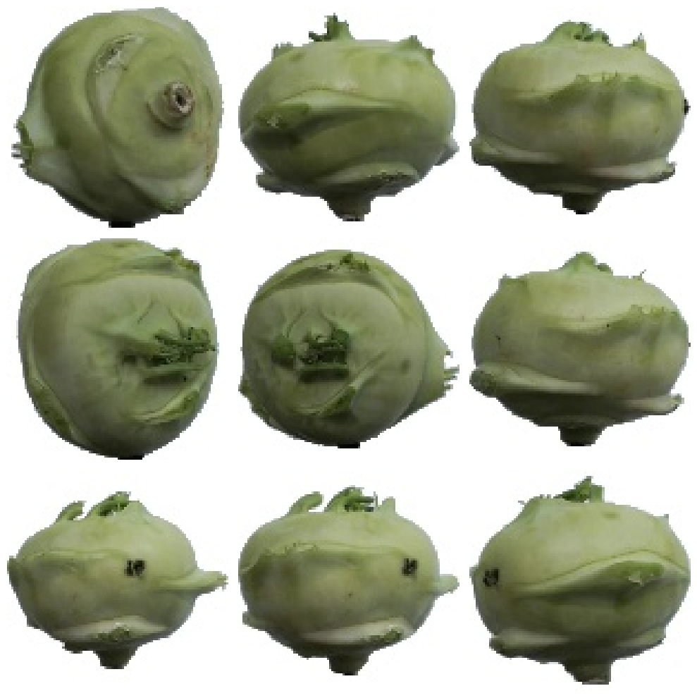
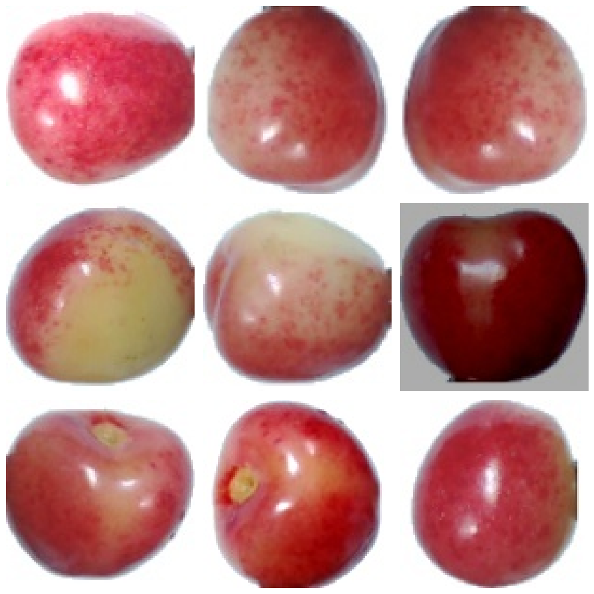
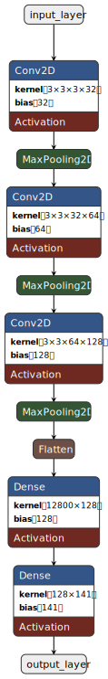
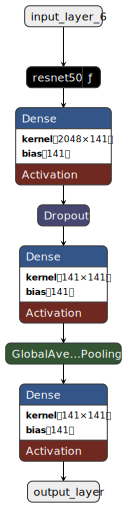
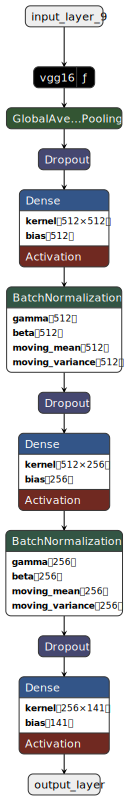
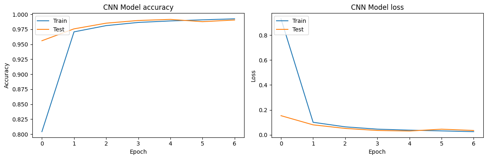
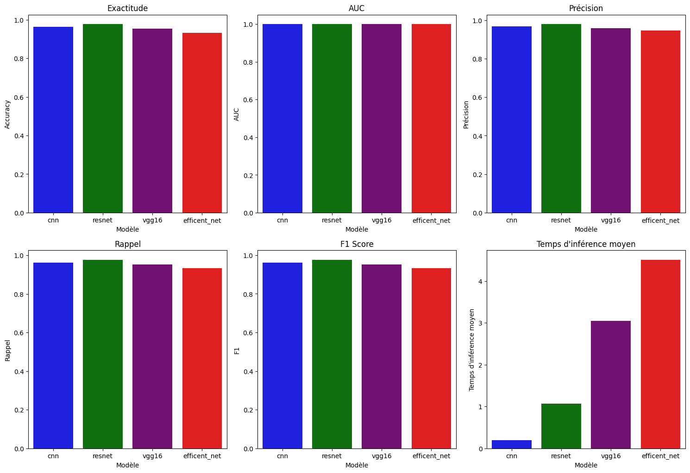
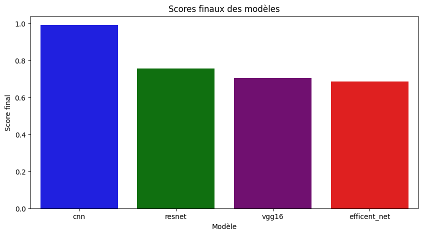

# **Aperçu du Projet** 🚀


#### 📑 Table des Matières
1. [🚀 Aperçu du Projet](#aperçu-du-projet)
2. [🍎🍌🍇 Problème de Classification](#problème-de-classification)
3. [🎯 Objectif](#objectif)
4. [🔄 Flux de Travail](#flux-de-travail)
5. [📂 Récupérer les Données et Installer les Dépendances](#récupérer-les-données-et-installer-les-dépendances)
6. [📚⚙️ Paramètres Généraux du Training](#paramètres-généraux-du-training)
7. [🛠️ Fonctions Utiles](#fonctions-utiles)
8. [🍎🍌🍇 Chargement des Données et Visualisation des Fruits](#chargement-des-données-et-visualisation-des-fruits)
9. [📈 Data Augmentation et Visualisation des Fruits Augmentés](#data-augmentation-et-visualisation-des-fruits-augmentés)
10. [🏛️ Architecture des Modèles](#architecture-des-modèles)
11. [🚀📊 Train, Plot, and Evaluate the Models](#train-plot-and-evaluate-the-models)
12. [🏅 Évaluation des Modèles et Benchmarking](#évaluation-des-modèles-et-benchmarking)
13. [🎉 Conclusion](#conclusion)
14. [📜 Références et Ressources Utiles](#références-et-ressources-utiles)
15. [📧 Contact](#contact)


## **Problème de Classification** 🍎🍌🍇


Le but de ce projet est de développer et d'évaluer plusieurs modèles d'intelligence artificielle capables de classifier des images de fruits. Les images utilisées dans ce projet sont de taille 100x100 pixels. Nous cherchons à entraîner des modèles qui peuvent reconnaître et classer différents types de fruits, tels que des pommes, des bananes, etc.

## Objectif 🎯

Dans ce projet, nous visons à entraîner et évaluer quatre modèles différents pour la classification d'images. Les modèles avec lesquels nous travaillons incluent :

1. **Modèle CNN Personnalisé** 🛠️
2. **EfficientNet** ⚡
3. **ResNet** 🕸️
4. **VGG16** 🏛️


# **Flux de Travail** 🔄

1. **Chargement et Prétraitement des Données** 📂  
   - Chargement du jeu de données et division en ensembles d'entraînement et de validation.  
   - Utilisation de techniques d'augmentation de données.

2. **Création et Compilation des Modèles** 🛠️  
   - Définition et compilation des modèles avec des fonctions de perte et optimiseurs adaptés.

3. **Entraînement des Modèles** 🏋️‍♂️  
   - Surveillance des performances pour éviter le surapprentissage. 

4. **Évaluation des Modèles** 🧪  
   - Calcul de métriques : Accuracy, AUC, précision, rappel, F1, temps d'inférence. 

5. **Visualisation** 📊  
   - Génération de graphiques et matrices de confusion pour évaluer les résultats.

6. **Benchmarking** 🏅  
   - Comparaison des modèles via une métrique pondérée personnalisée.

7. **Gestion des Artéfacts** 💾  
   - Sauvegarde des modèles, graphiques et journaux.


# **Récupérer les Données et Installer les Dépendances**  

1. **Cloner le dépôt GitHub contenant les données** :  
   [Lien des données](https://github.com/fruits-360/fruits-360-100x100) 🍎🍌🍇 

   
   Les données téléchargées sont divisées en deux dossiers : `Training` et `Test`.

   - Le dossier `Training` contient 70,491 images. Nous appliquerons de la data augmentation 
   pour obtenir un total de 422,946 images. Ces images seront ensuite divisées en deux ensembles :
   - `train_ds` : 317,209 images (75%)
   - `val_ds` : 105,737 images (25%)

   - Le dossier `Test` contient 23,619 images qui seront utilisées pour évaluer les modèles.

   Le dataset est composé d'images de 141 classes de fruits.

   ### Arborescence du processus de division des données
   ```markdown
   data/  
   ├── Training/ (70,491 images)  
   │   ├── Augmented/(422,946 images)  
   │   │   ├── train_ds/(317,209 images - 75%)  
   │   │   └── val_ds/(105,737 images - 25%)  
   └── Test/ (23,619 images)  
   ```

2. **Installer les dépendances** :  
   - Installation des bibliothèques nécessaires à l’entraînement.


# **Paramètres Généraux du Training** 📚⚙️

- **image_size** : 100x100 pixels  
- **batch_size** : 128  
- **epochs** : 10  
- **patience** : 2  


# **Fonctions Utiles** 🛠️

1. **Chargement et Augmentation des Données** 📂🔄  
   - **`load_data()`** : Divise les données en ensembles d'entraînement et de validation.  
   - **`data_augmentation()`** : Applique des augmentations.  

2. **Création et Compilation des Modèles** 🛠️  
   - **`create_cnn_model()`**, **`create_resnet_model()`**, **`create_efficientnet_model()`**, **`create_vgg16_model()`**.  

3. **Entraînement et Évaluation** 🏋️‍♂️🧪  
   - **`train_model()`**, **`evaluate_model()`**, **`plot_training_history()`**, **`plot_confusion_matrix()`**.  

4. **Gestion des Artéfacts** 💾  
   - **`zip_directory()`** : Compresse un répertoire.


# **Chargement des Données et Visualisation des Fruits** 🍎🍌🍇

Visualisez une grille d'images issues du dataset pour vérifier leur intégrité :  
  


# **Data Augmentation et Visualisation des Fruits Augmentés** 📈  
L'augmentation inclut la rotation, le flip et l’ajustement de contraste :  
  


# **Architecture des Modèles** 🏛️

<div style="text-align: center;">
<table style="margin: auto;">
<tr>
<th>CNN Custom</th>
<th>EfficientNet</th>
<th>ResNet</th>
<th>VGG16</th>
</tr>
<tr>
<td>

</td>
<td>

</td>
<td>

</td>
<td>

</td>
</tr>
</table>
</div>


# **Train, Plot, and Evaluate the Models** 🚀📊  

1. **Train the Models** 🏋️‍♂️  
2. **Plot the Training History** 📈  
3. **Evaluate the Models** 🧪  

  


# **Évaluation des Modèles et Benchmarking** 🏅

1. **Chargement des Modèles** 📥 :  
   - Les modèles sont testés sur des données jamais vues.

2. **Calcul des Métriques** 📊 :  
   - Exactitude, AUC, Précision, Rappel, F1 Score, Temps d'inférence.


3. **Benchmarking** 🏆 :  
   - Calcul d'une métrique pondérée pour sélectionner le modèle optimal.

| Métrique                  | Coefficient |
|---------------------------|-------------|
| Accuracy 🎯               | 0.4         |
| AUC 📈                    | 0.1         |
| Précision 🧮              | 0.1         |
| Rappel 🔍                 | 0.1         |
| F1 🏆                     | 0.1         |
| Temps d'inférence moyen ⏱️ | 0.2         |


| Modèle       | Accuracy 🎯 | AUC 📈 | Précision 🧮 | Rappel 🔍 | F1 🏆 | Temps d'inférence moyen ⏱️ | Score final 🏅 |
|--------------|-------------|--------|--------------|-----------|-------|-----------------------------|----------------|
| CNN          | 0.985317    | 0.999915| 0.988543     | 0.985317  | 0.984813| 1.000000                    | 0.989986       |
| ResNet       | 1.000000    | 1.000000| 1.000000     | 1.000000  | 1.000000| 0.185564                    | 0.837113       |
| VGG16        | 0.974489    | 0.999853| 0.977447     | 0.974489  | 0.973609| 0.065214                    | 0.795378       |
| EfficientNet | 0.954392    | 0.999682| 0.965315     | 0.954392  | 0.954058| 0.044032                    | 0.777908       |




# **Conclusion** 🎉

Le projet se termine par la sélection du modèle le plus performant. Le modèle choisi sera recommandé pour des tâches futures de classification d'images.  


# **Références et Ressources Utiles**  
- **Albumentations :** [Documentation](https://albumentations.ai/docs/)  
- **Keras Callbacks :** [ModelCheckpoint](https://keras.io/api/callbacks/model_checkpoint/)  
- **ResNet et Fine-Tuning :** [Article de référence](https://arxiv.org/abs/1512.03385)  
- **EfficientNet :** [Article de recherche](https://arxiv.org/abs/1905.11946)  
- **Introduction aux métriques ML :** [Guide Sklearn](https://scikit-learn.org/stable/modules/model_evaluation.html)


#### 📧 Contact
Pour toute question ou suggestion, veuillez contacter Abraham KOLOBOE à l'adresse email [abklb27@gmail.com](mailto:abklb27@gmail.com).


Merci pour votre attention ! 😊