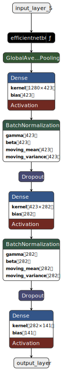

# **Aperçu du Projet** 🚀

## **Problème de Classification** 🍎🍌🍇
Le projet vise à développer plusieurs modèles d’intelligence artificielle capables de classifier des images de fruits (100x100 pixels). L’objectif est d’entraîner des modèles pour reconnaître et classer différents types de fruits, comme des pommes, des bananes, etc.

Le but de ce projet est de développer et d'évaluer plusieurs modèles d'intelligence artificielle capables de classifier des images de fruits. Les images utilisées dans ce projet sont de taille 100x100 pixels. Nous cherchons à entraîner des modèles qui peuvent reconnaître et classer différents types de fruits, tels que des pommes, des bananes, etc.

## Objectif 🎯

L'objectif principal est de comparer les performances de différents modèles de classification d'images, y compris un modèle CNN personnalisé, EfficientNet, ResNet et VGG16. Nous espérons identifier le modèle le plus performant pour la tâche de classification des fruits.

Dans ce projet, nous visons à entraîner et évaluer quatre modèles différents pour la classification d'images. Les modèles avec lesquels nous travaillons incluent :

1. **Modèle CNN Personnalisé** 🛠️
2. **EfficientNet** ⚡
3. **ResNet** 🕸️
4. **VGG16** 🏛️

# **Flux de Travail** 🔄

1. **Chargement et Prétraitement des Données** 📂  
   - Chargement du jeu de données et division en ensembles d'entraînement et de validation.  
   - Utilisation de techniques d'augmentation de données.

2. **Création et Compilation des Modèles** 🛠️  
   - Définition et compilation des modèles avec des fonctions de perte et optimiseurs adaptés.

3. **Entraînement des Modèles** 🏋️‍♂️  
   - Surveillance des performances pour éviter le surapprentissage. 

4. **Évaluation des Modèles** 🧪  
   - Calcul de métriques : Accuracy, AUC, précision, rappel, F1, temps d'inférence. 

5. **Visualisation** 📊  
   - Génération de graphiques et matrices de confusion pour évaluer les résultats.

6. **Benchmarking** 🏅 
   - Comparaison des modèles via une métrique pondérée personnalisée.

7. **Gestion des Artéfacts** 💾  
   - Sauvegarde des modèles, graphiques et journaux.

# **Récupérer les Données et Installer les Dépendances**  

1. **Cloner le dépôt GitHub contenant les données** :  
   [Lien des données](https://github.com/fruits-360/fruits-360-100x100) 🍎🍌🍇  

2. **Installer les dépendances** :  
   - Installation des bibliothèques nécessaires à l’entraînement.

# **Paramètres Généraux du Training** 📚⚙️

- **image_size** : 100x100 pixels  
- **batch_size** : 128  
- **epochs** : 10  
- **patience** : 2  

# **Fonctions Utiles** 🛠️

1. **Chargement et Augmentation des Données** 📂🔄  
   - **`load_data()`** : Divise les données en ensembles d'entraînement et de validation.  
   - **`data_augmentation()`** : Applique des augmentations.  

2. **Création et Compilation des Modèles** 🛠️  
   - **`create_cnn_model()`**, **`create_resnet_model()`**, **`create_efficientnet_model()`**, **`create_vgg16_model()`**.  

3. **Entraînement et Évaluation** 🏋️‍♂️🧪  
   - **`train_model()`**, **`evaluate_model()`**, **`plot_training_history()`**, **`plot_confusion_matrix()`**.  

4. **Gestion des Artéfacts** 💾  
   - **`zip_directory()`** : Compresse un répertoire.

# **Chargement des Données et Visualisation des Fruits** 🍎🍌🍇

Visualisez une grille d'images issues du dataset pour vérifier leur intégrité :  
  

# **Data Augmentation et Visualisation des Fruits Augmentés** 📈  
L'augmentation inclut la rotation, le flip et l’ajustement de contraste :  
  

# **Architecture des Modèles** 🏛️

<table style="margin: auto;">
<tr>
<th>CNN Custom</th>
<th>EfficientNet</th>
<th>ResNet</th>
<th>VGG16</th>
</tr>
<tr>
<td>

</td>
<td>

</td>
<td>

</td>
<td>

</td>
</tr>
</table>

# **Train, Plot, and Evaluate the Models** 🚀📊  

1. **Train the Models** 🏋️‍♂️  
2. **Plot the Training History** 📈  
3. **Evaluate the Models** 🧪  

  

# **Évaluation des Modèles et Benchmarking** 🏅

1. **Chargement des Modèles** 📥 :  
   - Les modèles sont testés sur des données jamais vues.

2. **Calcul des Métriques** 📊 :  
   - Exactitude, AUC, Précision, Rappel, F1 Score, Temps d'inférence.

3. **Benchmarking** 🏆 :  
   - Calcul d'une métrique pondérée pour sélectionner le modèle optimal.

| Métrique                  | Coefficient |
|---------------------------|-------------|
| Accuracy 🎯               | 0.4         |
| AUC 📈                    | 0.1         |
| Précision 🧮              | 0.1         |
| Rappel 🔍                 | 0.1         |
| F1 🏆                     | 0.1         |
| Temps d'inférence moyen ⏱️ | 0.2         |

| Modèle       | Accuracy 🎯 | AUC 📈 | Précision 🧮 | Rappel 🔍 | F1 🏆 | Temps d'inférence moyen ⏱️ | Score final 🏅 |
|--------------|-------------|--------|--------------|-----------|-------|-----------------------------|----------------|
| CNN          | 0.985317    | 0.999915| 0.988543     | 0.985317  | 0.984813| 1.000000                    | 0.989986       |
| ResNet       | 1.000000    | 1.000000| 1.000000     | 1.000000  | 1.000000| 0.185564                    | 0.837113       |
| VGG16        | 0.974489    | 0.999853| 0.977447     | 0.974489  | 0.973609| 0.065214                    | 0.795378       |
| EfficientNet | 0.954392    | 0.999682| 0.965315     | 0.954392  | 0.954058| 0.044032                    | 0.777908       |

# **Conclusion** 🎉

Le projet se termine par la sélection du modèle le plus performant. Le modèle choisi sera recommandé pour des tâches futures de classification d'images.  

# **Références et Ressources Utiles**  
- **Albumentations :** [Documentation](https://albumentations.ai/docs/)  
- **Keras Callbacks :** [ModelCheckpoint](https://keras.io/api/callbacks/model_checkpoint/)  
- **ResNet et Fine-Tuning :** [Article de référence](https://arxiv.org/abs/1512.03385)  
- **EfficientNet :** [Article de recherche](https://arxiv.org/abs/1905.11946)  
- **Introduction aux métriques ML :** [Guide Sklearn](https://scikit-learn.org/stable/modules/model_evaluation.html)

Merci pour votre attention ! 😊