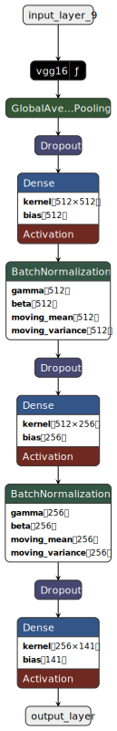

## Aperçu du Projet 🚀

### Problème de Classification 🍎🍌🍇

Le but de ce projet est de développer et d'évaluer plusieurs modèles d'intelligence artificielle capables de classifier des images de fruits. Les images utilisées dans ce projet sont de taille 100x100 pixels. Nous cherchons à entraîner des modèles qui peuvent reconnaître et classer différents types de fruits, tels que des pommes, des bananes, etc.

### Objectif 🎯

L'objectif principal est de comparer les performances de différents modèles de classification d'images, y compris un modèle CNN personnalisé, EfficientNet, ResNet et VGG16. Nous espérons identifier le modèle le plus performant pour la tâche de classification des fruits.

Dans ce projet, nous visons à entraîner et évaluer quatre modèles différents pour la classification d'images. Les modèles avec lesquels nous travaillons incluent :

1. **Modèle CNN Personnalisé** 🛠️
2. **EfficientNet** ⚡
3. **ResNet** 🕸️
4. **VGG16** 🏛️

### Flux de Travail 🔄

1. **Chargement et Prétraitement des Données** 📂:
    - Nous commençons par charger le jeu de données et le diviser en ensembles d'entraînement et de validation.
    - Des techniques d'augmentation des données sont appliquées pour améliorer le jeu de données d'entraînement.

2. **Création et Compilation des Modèles** 🛠️:
    - Nous définissons des fonctions pour créer et compiler chacun des quatre modèles.
    - Les modèles sont compilés avec des fonctions de perte et des optimiseurs appropriés.

3. **Entraînement des Modèles** 🏋️‍♂️:
    - Chaque modèle est entraîné sur le jeu de données d'entraînement augmenté.
    - Le processus d'entraînement inclut la surveillance des performances de validation pour éviter le surapprentissage.

4. **Évaluation** 🧪:
    - Après l'entraînement, les modèles sont évalués sur un jeu de données de test séparé.
    - Diverses métriques telles que l'exactitude, l'AUC, la précision, le rappel, le score F1 et le temps d'inférence sont calculées.

5. **Visualisation** 📊:
    - L'historique de l'entraînement et les métriques d'évaluation sont visualisés à l'aide de graphiques.
    - Des matrices de confusion sont générées pour comprendre les performances de chaque modèle.

6. **Benchmarking** 🏅:
    - Un processus de benchmarking personnalisé est mis en œuvre pour comparer les modèles en fonction de métriques pondérées.
    - Le modèle avec le score final le plus élevé est sélectionné comme le modèle le plus performant.

7. **Gestion des Artéfacts** 💾:
    - Tous les modèles et artéfacts (par exemple, les journaux d'entraînement, les graphiques) sont sauvegardés et compressés pour un partage et une analyse faciles.

### Conclusion 🎉

Le projet se conclut par la sélection du modèle le plus performant basé sur le processus de benchmarking personnalisé. Le modèle sélectionné est recommandé pour les tâches futures liées à la classification d'images.

Merci pour votre attention et votre intérêt pour ce projet ! 😊

## Récupérer les données et installer les dépendances

Pour commencer ce projet, nous devons récupérer les données et installer les dépendances nécessaires. Voici les étapes à suivre :

1. **Cloner le dépôt GitHub contenant les données** :
    - Nous allons cloner le dépôt GitHub qui contient les données nécessaires pour ce projet.
    [Lien des données](https://github.com/fruits-360/fruits-360-100x100) 🍎🍌🍇

2. **Installer les dépendances** :
    - Nous allons installer les bibliothèques Python nécessaires pour l'entraînement et l'évaluation des modèles. 🛠️📦

## Importer les bibliothèques nécessaires et définir les paramètres généraux du training 📚⚙️

Pour commencer, nous devons importer les bibliothèques nécessaires et définir les paramètres généraux pour l'entraînement des modèles. Voici les paramètres que nous allons utiliser :

- **image_size** : La taille des images d'entrée

## Importer les bibliothèques nécessaires et définir les paramètres généraux du training 📚⚙️

Pour commencer, nous devons importer les bibliothèques nécessaires et définir les paramètres généraux pour l'entraînement des modèles. Voici les paramètres que nous allons utiliser :

- **image_size** : La taille des images d'entrée (100x100 pixels).
- **batch_size** : La taille des lots pour l'entraînement (128).
- **epochs** : Le nombre d'époques pour l'entraînement (10).
- **patience** : Le nombre d'époques sans amélioration avant d'arrêter l'entraînement (2).

Ces paramètres sont essentiels pour configurer correctement nos modèles et optimiser le processus d'entraînement.

## Création des Fonctions Utiles pour la Suite 🛠️

Dans cette section, nous allons définir toutes les fonctions nécessaires pour la suite de notre projet. Ces fonctions incluront des méthodes pour charger les données, appliquer des augmentations de données, créer et compiler des modèles, entraîner les modèles, évaluer les performances des modèles, et visualiser les résultats.

### Fonctions pour le Chargement et l'Augmentation des Données 📂🔄

1. **load_data** : Charge et divise les données en ensembles d'entraînement et de validation.
2. **data_augmentation** : Applique des augmentations de données aux images d'entraînement.

### Fonctions pour la Création et la Compilation des Modèles 🛠️

1. **create_cnn_model** : Crée un modèle CNN personnalisé.
2. **create_resnet_model** : Crée un modèle ResNet.
3. **create_efficientnet_model** : Crée un modèle EfficientNet.
4. **create_vgg16_model** : Crée un modèle VGG16.
5. **compile_model** : Compile un modèle avec les paramètres d'entraînement spécifiés.

### Fonctions pour l'Entraînement et l'Évaluation des Modèles 🏋️‍♂️🧪

1. **train_model** : Entraîne un modèle et sauvegarde le meilleur modèle et le journal d'entraînement.
2. **evaluate_model** : Évalue un modèle et génère une matrice de confusion.
3. **plot_training_history** : Trace l'historique d'entraînement d'un modèle.
4. **plot_confusion_matrix** : Trace la matrice de confusion pour un modèle.

### Fonctions pour la Visualisation des Images 📊

1. **display_images_grid** : Affiche une grille d'images à partir d'un répertoire spécifié.
2. **display_images_grid_augmented** : Affiche une grille d'images augmentées à partir d'un répertoire spécifié.
3. **print_number_images_after_augmentation** : Affiche le nombre d'images avant et après l'augmentation des données.

### Fonctions pour la Gestion des Artéfacts 💾

1. **zip_directory** : Compresse le contenu d'un répertoire spécifié.

### Fonctions pour l'Évaluation sur l'Ensemble de Test 🚀

1. **evaluate_model_on_test_set** : Évalue un modèle sur l'ensemble de test et retourne un dictionnaire avec les résultats.

Ces fonctions nous permettront de structurer et d'automatiser notre flux de travail, facilitant ainsi l'entraînement, l'évaluation et la comparaison des différents modèles de classification d'images. 🚀

## Charger les Données et les Diviser en Ensembles d'Entraînement et de Validation 📂🔄

Pour charger les données et les diviser en ensembles d'entraînement et de validation, vous pouvez utiliser le code suivant :

## Visualisation des Fruits 🍎🍌🍇

Dans cette section, nous allons visualiser des images de fruits. Nous allons sélectionner un dossier au hasard et afficher des photos de fruits. Chaque fois que vous exécutez cette cellule, vous verrez des images différentes.

Cela nous permet de vérifier visuellement les données et de s'assurer que les images sont correctement chargées et prétraitées.

## Visualisation des Fruits 🍎🍌🍇

Dans cette section, nous allons visualiser des images de fruits. Nous allons sélectionner un dossier au hasard et afficher des photos de fruits. Chaque fois que vous exécutez cette cellule, vous verrez des images différentes.

Cela nous permet de vérifier visuellement les données et de s'assurer que les images sont correctement chargées et prétraitées.

# Data Augmentation
Pour améliorer la performance de nos modèles, nous allons procéder à la data augmentation des données d'entraînement. La data augmentation permet de générer des variations des images d'entraînement, ce qui aide les modèles à généraliser mieux et à être plus robustes face aux variations des données réelles. 🚀

Nous allons utiliser des techniques telles que la rotation, la transposition, le flip horizontal et vertical, ainsi que des ajustements de luminosité et de contraste. 🍎📈

## Visualisation des Fruits Augmentés 🍎🍌🍇

Dans cette section, nous allons visualiser des images de fruits issues de la data augmentation. Nous allons sélectionner un dossier au hasard et afficher des photos de fruits augmentées. Chaque fois que vous exécutez cette cellule, vous verrez des images différentes.

Cela nous permet de vérifier visuellement les données augmentées et de s'assurer que les images sont correctement générées et prétraitées.

 Entrainement des modèles 🏋️‍♂️🤖
Dans cette section, nous allons entraîner plusieurs modèles, y compris un CNN personnalisé, EfficientNet, ResNet et VGG16. Le processus d'entraînement comprend les étapes suivantes :

1. **Entraînement des Modèles** 🏋️‍♂️: Nous allons entraîner chaque modèle sur le jeu de données d'entraînement. Pendant l'entraînement, nous surveillerons les performances des modèles sur le jeu de données de validation pour nous assurer qu'ils apprennent efficacement.

2. **Évaluation des Modèles** 🧪: Après l'entraînement, nous évaluerons les modèles sur le jeu de données de validation. Cette évaluation inclura le calcul de métriques telles que l'exactitude, la précision, le rappel, le score F1 et l'AUC.

3. **Visualisation des Métriques** 📊: Nous tracerons l'historique d'entraînement de chaque modèle, y compris l'exactitude et la perte au fil des époques. De plus, nous générerons et enregistrerons des matrices de confusion pour visualiser les performances des modèles sur le jeu de données de validation.

4. **Sauvegarde des Artéfacts** 💾: Tous les artéfacts, y compris les journaux d'entraînement, les graphiques d'exactitude et les matrices de confusion, seront sauvegardés dans des dossiers dédiés pour chaque modèle. Cela nous aidera à analyser et comparer les performances des modèles.

Juste après cette cellule, vous trouverez l'architecture des modèles que nous avons implémentés.

<table style="margin: auto;">
<tr>
<th>CNN Custom</th>
<th>EfficientNet</th>
<th>ResNet</th>
<th>VGG16</th>
</tr>
<tr>
<td>

</td>
<td>

</td>
<td>

</td>
<td>

</td>
</tr>
</table>

### Train, Plot, and Evaluate the Models 🚀📊

In this section, we will:

1. **Train the Models** 🏋️‍♂️
2. **Plot the Training History** 📈
3. **Evaluate the Model** 🧪

Let's get started! 🎉

## Évaluation des Modèles 🚀

Dans cette section, nous allons évaluer tous les modèles que nous avons sauvegardés lors de la phase d'entraînement. Voici les étapes détaillées de notre processus d'évaluation :

1. **Chargement des Modèles et des Ensembles de Test** 📥 :
    - Nous allons commencer par charger tous les modèles que nous avons sauvegardés précédemment.
    - Ensuite, nous chargerons les ensembles de données de test qui n'ont jamais été vus par les modèles.

2. **Calcul des Métriques d'Évaluation** 📊 :
    - Pour chaque modèle, nous calculerons les métriques suivantes : Accuracy, AUC, Précision, Rappel, F1 Score et le Temps d'inférence moyen.
    - Ces métriques nous permettront de mesurer les performances des modèles sur les données de test.

3. **Affichage d'une Prédiction Aléatoire** 🎲 :
    - Après chaque évaluation, nous afficherons une prédiction aléatoire sur une image du jeu de données de test. Cela nous permettra de visualiser les performances des modèles sur des exemples concrets.

4. **Benchmarking et Calcul d'une Métrique Personnalisée** 🏅 :
    - Avant de comparer les modèles, nous effectuerons un benchmarking en assignant des coefficients à chaque métrique.
    - Nous calculerons une métrique personnalisée ou finale en combinant les différentes métriques pondérées par leurs coefficients respectifs.

5. **Sélection du Modèle Optimal** 🏆 :
    - En utilisant la métrique personnalisée, nous réévaluerons les modèles.
    - Le modèle ayant la meilleure performance selon cette métrique sera sélectionné comme le modèle le plus adapté à nos besoins.

Ce processus nous permettra de déterminer de manière rigoureuse et objective quel modèle est le plus performant pour la reconnaissance des fruits. 🍎🍌🍇

## Chargement des Données Test 📂

Dans cette section, nous allons charger les données de test. Ces données n'ont jamais été vues par les modèles pendant l'entraînement et la validation. Elles nous permettront d'évaluer les performances réelles des modèles sur des données inédites.

Nous utiliserons les paramètres suivants pour le chargement des données :
- **image_size** : La taille des images d'entrée (100x100 pixels).
- **batch_size** : La taille des lots pour l'évaluation (128).

Voici le code pour charger les données de test :

## Chargement et Visualisation des Métriques Calculées 📊

Dans cette section, nous allons charger les métriques calculées lors des évaluations des modèles et les afficher sous forme de graphiques. Cela nous permettra de comparer visuellement les performances des différents modèles sur plusieurs métriques.

Les métriques que nous allons visualiser sont les suivantes :
- Accuracy 🎯
- AUC 📈
- Précision 🧮
- Rappel 🔍
- F1 🏆
- Temps d'inférence moyen ⏱️

Nous utiliserons des barplots pour représenter ces métriques pour chaque modèle.

## Chargement et Visualisation des Métriques Calculées 📊

Dans cette section, nous allons charger les métriques calculées lors des évaluations des modèles et les afficher sous forme de graphiques. Cela nous permettra de comparer visuellement les performances des différents modèles sur plusieurs métriques.

Les métriques que nous allons visualiser sont les suivantes :
- Accuracy 🎯
- AUC 📈
- Précision 🧮
- Rappel 🔍
- F1 🏆
- Temps d'inférence moyen ⏱️

Nous utiliserons des barplots pour représenter ces métriques pour chaque modèle.

## Benchmarking des Modèles 📊

Pour évaluer les performances des différents modèles, nous avons attribué des coefficients à chaque métrique et calculé un score final pour chaque modèle. Voici les coefficients utilisés pour chaque métrique :

| Métrique                  | Coefficient |
|---------------------------|-------------|
| Accuracy 🎯               | 0.4         |
| AUC 📈                    | 0.1         |
| Précision 🧮              | 0.1         |
| Rappel 🔍                 | 0.1         |
| F1 🏆                     | 0.1         |
| Temps d'inférence moyen ⏱️ | 0.2         |

## Décision Finale 🎉

Après avoir évalué les performances des différents modèles sur plusieurs métriques, nous avons calculé un score final pour chaque modèle en utilisant des coefficients spécifiques pour chaque métrique. Voici les résultats finaux :

| Modèle       | Accuracy 🎯 | AUC 📈 | Précision 🧮 | Rappel 🔍 | F1 🏆 | Temps d'inférence moyen ⏱️ | Score final 🏅 |
|--------------|-------------|--------|--------------|-----------|-------|-----------------------------|----------------|
| CNN          | 0.985317    | 0.999915| 0.988543     | 0.985317  | 0.984813| 1.000000                    | 0.989986       |
| ResNet       | 1.000000    | 1.000000| 1.000000     | 1.000000  | 1.000000| 0.185564                    | 0.837113       |
| VGG16        | 0.974489    | 0.999853| 0.977447     | 0.974489  | 0.973609| 0.065214                    | 0.795378       |
| EfficientNet | 0.954392    | 0.999682| 0.965315     | 0.954392  | 0.954058| 0.044032                    | 0.777908       |

Le modèle CNN a obtenu le score final le plus élevé 🏆, ce qui en fait le modèle le plus performant selon nos critères. Il est donc recommandé d'utiliser le modèle CNN pour les tâches futures.

C'est donc lui qu'on va utiliser par la suite. 🚀